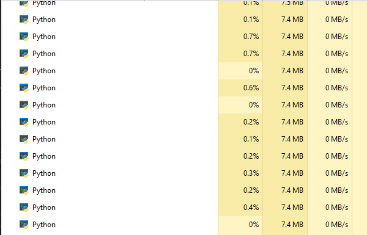

# Basics

### System & Files 

- In this part we will use these libraries.

```python
import sys,os,subprocess,shutil
```

[sys](https://docs.python.org/3/library/sys.html)

- Library allows you to interact with the Python interpreter we can use it to:
* handle command-line arguments
* managing i/o
* exit from the program

First we need to know what is command line arguments ?
its a value passed to the program when executing it:

```bash
python3 script.py val1 val2 val3
```
We can access these values using:
```python
script = sys.argv[0] # programe name
val1 = sys.argv[1] 
val2 = sys.argv[2]
```
sys.argv is a list that conatins all the arguments

- this is another usages

```python
try:
    ip = sys.argv[1]
    port = sys.argv[2]
except IndexError:
    print("Usage: python script.py <ip> <port>")
```

```python
sys.stdout.write("Hello World") # like print
sys.stderr.write("[!] Error ...") # print to stderr
sys.exit(0) # exit from the program
```

[subprocess](https://docs.python.org/3/library/subprocess.html)
- allows you to run external commands and programs from your Python code.

- Examples:

```python
cmd = 'powershell -ep bypass -c Write-Host "Hello World"' # Command to execute
cmd2 = 'python -m http.server 8080'
subprocess.run(cmd) # The Execution will stop until it ends
subprocess.Popen(cmd2,stdout=subprocess.DEVNULL) # Background Process
result = subprocess.check_output(cmd,text=True) # result = "Hello World"
```
[os](https://docs.python.org/3/library/os.html)

- provides a way to interact with the operating system.
- It allows you to perform common tasks like managing files and directories
- working with environment variables, and executing system commands

- Useful Examples:

```python
os_name = os.name # "nt" if windows "posix" if linux
currdir = os.getcwd() # Get Current Directory
files = os.listdir() # return list with files,dirs in current or specific dir
partitions = os.listdrives() # ['C:\\','D:\\'....]
env_vars = os.getenv("TEMP") # Env Variables C:\Users\...\AppData\Local\Temp
os.system("clear") # execute command
os.popen("any code") # background process
os.mkdir("NewDir") # make directory
os.chdir("Downloads") # change Directory
os.rename("old.txt","new.txt") # rename file
os.remove("file.txt") # remove file
os.rmdir("temporary") # remove empty directory
os.chmod("new.txt",777) # change file privilages
if os.path.exists("path"): pass # check if path exists
if os.path.isfile("path"): pass # check is file
if os.path.isdir("path"): pass # check if is directory
size = os.path.getsize("new.txt") # get file size (bytes)
full_path = os.path.join("C:\\Windows","System32\\calc.exe") # Merge two pathes
file_name = os.path.basename(full_path) # calc.exe
dir_path = os.path.dirname(full_path) # C:\Windows\System32
```

- That was the most used functions in os module

[shutil](https://docs.python.org/3/library/shutil.html)

this module offers collection of files,directories functions

- Example:

```python
shutil.copy(src_path,dst_path) # copy file
shutil.copy2(src_path,dst_path) # copy file with metadata
shutil.move(src,dst) # Recursively move a file or directory
shutil.rmtree(path) # remove a directory with all content
```

### Strings and log parsing

- Json Handle

```python
import json

data = '{"name":"0xf55","ip":"127.0.0.1"}'
json_data = json.loads(data) # parsed data
print(json_data["name"]) # get  name
print(json_data["ip"]) # get  ip

# Exporting Data to file
with open("data.json","w") as f:
    json.dump(json_data,f,indent=4)

# Load json data from file
with open("data.json","r") as r:
    json_from_file = json.load(r)
    print(json_from_file)
    print(json_from_file["name"])
```
- Output: 

```bash
0xf55
127.0.0.1
{'name': '0xf55', 'ip': '127.0.0.1'}
0xf55
```
- Logging

Logging is the process of recording events or messages that happen while a program runs. This helps you debug, monitor, and understand your code

- Why Logging?

- Helps track errors and issues.
- Useful for debugging and auditing.
- Better than using `print()` for real applications.

- The `logging` Module

Python has a built-in module called `logging` for this purpose.

- Basic Usage

```python
import logging

logging.basicConfig(level=logging.INFO)
logging.info("This is an info message")
logging.warning("This is a warning")
logging.error("This is an error")
```

- Logging to file

```python
logging.basicConfig( level=logging.DEBUG
                    , filename="log.txt"
                    , format='%(asctime)s - %(levelname)s - %(message)s')

logging.info("Opening File")
try:
    with open("new.txt") as f:
        logging.info("Reading Data")
        data = f.read()
except Exception as e:
    logging.error(e)
```

```log.txt
2025-08-03 17:25:24,949 - INFO - Opening File
2025-08-03 17:25:24,949 - INFO - Reading Data
```

- Regular Expression (Regex)
- It's used in programming and text editors for things like:
* Finding a specific format, such as all email addresses.
* Replacing text, such as changing all phone numbers from one format to another.
* Validating input, like making sure a user enters a valid password...

Lets take an example:
* You have a list contains valid and invalid email addresses
* We only need the valid

```python

import re

message = """
To the team,

As you know, we are in the process of upgrading our security systems. I have compiled a list of approved and unapproved addresses.

Approved IP Addresses (Valid):
203.1.113.15
172.16.155.254
10.0.0.1

Unapproved IP Addresses (Invalid):
192..168..1 (Contains 5 parts)
10.10..1 (Contains two consecutive dots)

Please update your blocklists according to these instructions.

Note: The address 203.0.113.15 is the main gateway, so make sure it is allowed.

Awaiting your confirmation.

Best regards,
The Security Team.
"""
pattern = r"\b\d{1,3}\.\d{1,3}\.\d{1,3}\.\d{1,3}\b" # simple search pattern
result = re.findall(pattern,message)
print(result)
```
- Output:
```bash
['203.1.113.15', '172.16.155.254', '10.0.0.1', '203.0.113.15']
```

- See more in 
[W3SchoolsRegex](https://www.w3schools.com/python/python_regex.asp)


- Challenge
* make an script takes 1 argument
* execute this argument
* show the output

```bash
python script.py whoami
```
- Output:
```bash
[+] Result:
 desktop-lpjpkce\....
```
- Solve

```python
import subprocess
import sys

if len(sys.argv) < 2:
    print("[+] Usage : python script.py command")
    sys.exit(0)

cmd = sys.argv[1]
result = subprocess.check_output(cmd,text=True)

print("[+] Result:\n",result)
```
- Try to challenge yourself more ...

### Multi threading,processing

- Process

A process is an instance of a program that is being executed by the operating system. Each process runs independently and has its own memory space.

- Thread

A thread is a unit of execution within a process. All threads in the same process share the same memory space, making them lightweight and efficient, but also requiring careful handling of shared data.

- Multiprocessing

Multiprocessing is a technique where multiple processes run in parallel. Each process has its own memory space, so they don't interfere with each other. This is useful for tasks that need to fully use multiple CPU cores.

- Threading

Threading is a technique where multiple threads run in parallel within the same process. Threads share the same memory, which allows for faster communication, but requires careful synchronization to avoid conflicts.


- Example:
when we execute this

```python
import time
def func():
    time.sleep(1)

func()
func()
func()
```

this will take a 3 seconds
lets make it faster with threading module

- Importing the Module
```python
import threading
```
now lets see how to use the module

```python
t1 = threading.Thread(target=func) # target = function to execute
t1.start() # starting the thread
```
the program will not wait a second beacuse we didn't wait for the thread

so lets add
```python
t1.join()
```
and program will wait until thread is finished

- Lets take another example

```python
import threading
import time

def func():
    time.sleep(2)

threads = [threading.Thread(target=func) for _ in range(100)]

for thread in threads:
    thread.start()

for thread in threads:
    thread.join()
```
100 thread slept only for 2 seconds instead of 200 seconds

* we can use it for i/o operations
* sockets handling
* and more...

- Multi Processing is the same but we use it when we want to use all cpu cores
* like math operations .....
* we will use threading much in our projects

```python
import multiprocessing
import time

def func():
    time.sleep(10)

if __name__ == '__main__':
    processes = [multiprocessing.Process(target=func) for _ in range(100)]

    for proc in processes:
        proc.start()

    for proc in processes:
        proc.join()```
```


### What is a Socket?

A **socket** is an endpoint for sending or receiving data across a computer network. It acts as a bridge between an application and the network protocol stack, allowing programs to communicate over local or remote networks.

- **Analogy:** Think of a socket as a telephone jack. To communicate, both parties need to be plugged into a socket.

### Types of Sockets

- **Stream Sockets (TCP):** Provide reliable, connection-oriented communication (like a phone call).
- **Datagram Sockets (UDP):** Provide connectionless, unreliable communication (like sending letters).

### How Sockets Work

1. **Server Side:**
   - Create a socket.
   - Bind it to an address and port.
   - Listen for incoming connections.
   - Accept connections and communicate.

2. **Client Side:**
   - Create a socket.
   - Connect to the server's address and port.
   - Send and receive data.

### Common Uses 

- RAT and C2
- Retriving Data From Stealers
- Control Device Remotly
- Chat applications
- File transfer

---

## Web Concepts

### The Web and HTTP

The **World Wide Web** is a system of interlinked documents and resources, accessed via the internet using web browsers. The main protocol used for communication on the web is **HTTP (Hypertext Transfer Protocol)**.

#### HTTP Basics

- **Request/Response Model:** Clients (browsers) send requests to servers, which respond with data (web pages, files, etc.).
- **Stateless:** Each request is independent; the server does not retain information about previous requests.

#### HTTP Methods

- **GET:** Retrieve data from the server.
- **POST:** Send data to the server.
- **PUT, DELETE, PATCH:** Modify or delete resources.


## Project

- Now we will write project for:
1. Analyzing Logs
2. Count number of logs
3. we will use threading to analyse more than file at same time

- Lets Start

```python
import os
import logging
import threading

logging.basicConfig(filename="log.txt",level=logging.DEBUG
                    ,format='%(asctime)s - %(levelname)s - %(message)s')

def analyse_log(file_name):
    if not os.path.exists(file_name):
        logging.error(f"File {file_name} Not Exists")
        return

    ALL = 0
    INFO = 0
    ERRORS = 0
    WARNING = 0

    logging.info("Opening file")
    with open(file_name,"r")as f:
        lines = f.readlines()
        for line in lines:
            line = line.lower()
            ALL += 1
            if "info" in line:
                INFO += 1
            elif "warning" in line:
                WARNING += 1
            elif "error" in line:
                ERRORS += 1

    logging.info("Finished Analyzing")
    print(f"########[{file_name}]########")
    print(f"ALL LOGS: {ALL}\n" \
          f"INFO LOGS: {INFO}\n" \
          f"WARNING LOGS: {WARNING}\n" \
          f"ERROR LOGS: {ERRORS}\n")
    

if __name__ == '__main__':
    log_files = ["log1.txt","log2.txt","log3.txt","not_exist.txt"]
    threads = [threading.Thread(target=analyse_log,args=[logf,]) for logf in log_files]
    for t in threads:
        t.start()
    for t in threads:
        t.join()
```

- Output

```bash
########[log1.txt]########
ALL LOGS: 9
INFO LOGS: 6
WARNING LOGS: 1
ERROR LOGS: 2

########[log2.txt]########
ALL LOGS: 11
INFO LOGS: 5
WARNING LOGS: 3
ERROR LOGS: 3

########[log3.txt]########
ALL LOGS: 10
INFO LOGS: 2
WARNING LOGS: 4
ERROR LOGS: 4
```

### Refrences
[python.org](https://www.python.org/)
[Wikipedia](https://www.wikipedia.org/)


